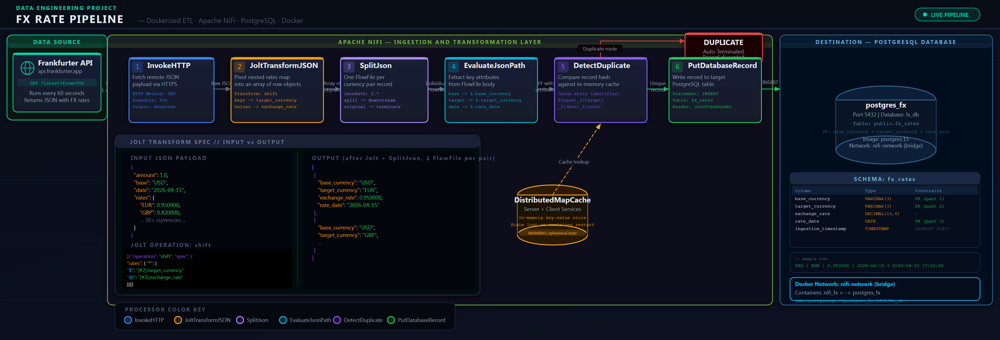

# FX Rate Pipeline: Dockerized In-Flight State Management

[](https://www.docker.com/)
[](https://nifi.apache.org/)
[](https://www.postgresql.org/)
[](https://www.frankfurter.app/)
[](LICENSE)

> **An intentionally flawed ETL pipeline built with Apache NiFi and PostgreSQL inside Docker, designed to surface and demonstrate the architectural limitations of in-flight stateful transformation — and why the industry moved from ETL to ELT.**

---

## 📖 Table of Contents

- [Architecture Diagram](#architecture-diagram)
- [1. The Architectural Critique — ETL vs ELT](#1-the-architectural-critique--etl-vs-elt)
- [2. Docker Infrastructure](#2-docker-infrastructure)
- [3. Database Initialization](#3-database-initialization)
- [4. Step-by-Step NiFi Implementation](#4-step-by-step-nifi-implementation)
- [5. Critical Failure Analysis](#5-critical-failure-analysis)
- [6. End-to-End Execution & Verification](#6-end-to-end-execution--verification)
- [Project Structure](#project-structure)

---

## Architecture Diagram



> The diagram above shows the simplified, symbol-driven data flow: from the Frankfurter REST API, through the six NiFi processors, through the cache check, and finally inserting into PostgreSQL. The `DROP ✗` path shows where duplicate records are silently discarded by the state cache.

---

## 1. The Architectural Critique — ETL vs ELT

> **⚠️ WARNING:**
> **This pipeline is intentionally designed with a known architectural flaw.** Read this section before building anything. The purpose of this project is to demonstrate *why* this flaw exists and what the modern alternative looks like.

### What Is Wrong Here?

This pipeline performs **transformation inside the ingestion layer** — the definition of ETL (Extract → Transform → Load). Specifically, NiFi is responsible for:

1. Flattening the nested JSON from the API into a flat row structure (Jolt).
2. Maintaining an in-memory state cache to detect and drop duplicate records (DetectDuplicate).

Both of these responsibilities belong **downstream** in a healthy, modern data stack.

### The Modern Alternative: ELT

In a modern **ELT** (Extract → Load → Transform) stack, the workflow would look like this:

| Concern | ETL (this project) | ELT (modern approach) |
| :--- | :--- | :--- |
| **Ingestion Tool** | Apache NiFi | Airbyte / Fivetran |
| **Raw Storage** | Flattened rows via Jolt | Raw `JSONB` column in PostgreSQL |
| **Transformation** | NiFi Jolt spec (XML/JSON config) | dbt SQL models (version-controlled) |
| **Deduplication** | NiFi DistributedMapCache (ephemeral) | `DISTINCT ON` / `ROW_NUMBER()` in SQL (persistent) |
| **Schema-drift detection** | Pipeline crashes silently | dbt tests catch it downstream |
| **Maintainability** | Low — Jolt specs are opaque | High — SQL is readable and testable |

> Building this pipeline will demonstrate, through hands-on failure, exactly why ELT replaced ETL as the dominant paradigm.

---

## 2. Docker Infrastructure

NiFi and PostgreSQL must run in the **same Docker bridge network** so they can resolve each other by container name (e.g., `postgres_fx`) rather than by IP address, which changes on each restart.

### Start the Environment

```bash
# Start both containers in detached mode
docker-compose up -d

# Verify both containers are healthy
docker ps

# Stream NiFi logs if something seems wrong
docker logs -f nifi_fx
```

### Access NiFi

Open **[https://localhost:8443/nifi](https://localhost:8443/nifi)** in your browser.

> **📝 NOTE:**
> NiFi uses a self-signed TLS certificate by default. Your browser will show a security warning — click **Advanced → Proceed** to bypass it. This is expected in local development. The credentials are set in `docker-compose.yml`:
>
> - **Username**: `admin`
> - **Password**: `SuperSecretPassword123!`

### docker-compose.yml Explained

```yaml
version: '3.8'

services:
  postgres:
    image: postgres:15             # Pinned major version for reproducibility
    container_name: postgres_fx    # Fixed name so NiFi can resolve it via DNS
    environment:
      POSTGRES_USER: nifi_user
      POSTGRES_PASSWORD: nifi_password
      POSTGRES_DB: fx_db
    ports:
      - "5432:5432"                # Expose to host for DBeaver / pgAdmin access
    networks:
      - nifi-network

  nifi:
    image: apache/nifi:latest
    container_name: nifi_fx
    ports:
      - "8443:8443"                # HTTPS UI
    environment:
      - SINGLE_USER_CREDENTIALS_USERNAME=admin
      - SINGLE_USER_CREDENTIALS_PASSWORD=SuperSecretPassword123!
      - NIFI_WEB_PROXY_HOST=localhost:8443,127.0.0.1:8443
    networks:
      - nifi-network               # Same network as postgres — required for JDBC
    depends_on:
      - postgres                   # Ensures postgres starts first

networks:
  nifi-network:
    driver: bridge
```

> **❗ IMPORTANT:**
> **Why `NIFI_WEB_PROXY_HOST` matters:** Modern NiFi versions strictly validate the HTTP Host header. Without this variable, accessing NiFi via `localhost:8443` will result in a connection rejection or "Invalid Host Header" error.
> 
> **Why `container_name` matters:** The JDBC connection URL in NiFi uses `postgres_fx` as the host (`jdbc:postgresql://postgres_fx:5432/fx_db`). Docker's internal DNS resolves container names within the same network. If you remove `container_name`, Docker assigns a random name and the JDBC connection will fail.

---

## 3. Database Initialization

Connect to the running `postgres_fx` container and create the target table:

```bash
# Connect via Docker CLI
docker exec -it postgres_fx psql -U nifi_user -d fx_db
```

Then execute the DDL:

```sql
CREATE TABLE fx_rates (
    base_currency        VARCHAR(3)      NOT NULL,
    target_currency      VARCHAR(3)      NOT NULL,
    exchange_rate        DECIMAL(10, 6)  NOT NULL,
    rate_date            DATE            NOT NULL,
    ingestion_timestamp  TIMESTAMP       DEFAULT CURRENT_TIMESTAMP,

    CONSTRAINT pk_fx_rate
        PRIMARY KEY (base_currency, target_currency, rate_date)
);
```

### Schema Decisions Explained

| Column | Type | Reason |
| :--- | :--- | :--- |
| `base_currency` | `VARCHAR(3)` | ISO 4217 currency codes are always 3 characters (e.g., `USD`, `EUR`) |
| `target_currency` | `VARCHAR(3)` | Same as above |
| `exchange_rate` | `DECIMAL(10, 6)` | Fixed-point avoids floating-point rounding errors in financial data |
| `rate_date` | `DATE` | The Frankfurter API returns one snapshot per calendar day |
| `ingestion_timestamp` | `TIMESTAMP DEFAULT NOW()` | Audit trail — when was this row written, not when the rate was valid |
| **Primary Key** | `(base, target, date)` | Enforces uniqueness at the database level as a last-resort guard against duplicates |

---

## 4. Step-by-Step NiFi Implementation

### Step 4.0: Prerequisite - Injecting the JDBC Driver

NiFi does not ship with the PostgreSQL driver by default. You must download it into the running container before configuring the connection pool. Open your host terminal and run:

```bash
docker exec -it nifi_fx wget https://jdbc.postgresql.org/download/postgresql-42.7.3.jar -P /tmp/
```

### Step 4.1: Controller Services Setup

NiFi relies on background services for connections, parsing, and state. Right-click anywhere on the blank NiFi canvas and select **Configure**. Navigate to the **Controller Services** tab. Click the `+` icon to add a new service. Search for and add each of the following:

#### DBCPConnectionPool

Click the gear icon to configure. Go to the **Properties** tab.

| Property | Value |
| :--- | :--- |
| **Database Connection URL** | `jdbc:postgresql://postgres_fx:5432/fx_db` |
| **Database Driver Class Name** | `org.postgresql.Driver` |
| **Database Driver Location(s)** | `/tmp/postgresql-42.7.3.jar` |
| **Database User** | `nifi_user` |
| **Password** | `nifi_password` |

Click **Apply**. Click the lightning bolt icon to **Enable** it.

#### JsonTreeReader

Click the gear icon. Leave all default properties (it will infer the schema automatically). Click **Apply**. Click the lightning bolt icon to **Enable** it.

#### DistributedMapCacheServer

Click the gear icon. Leave defaults (Port `4557`). Click **Apply**. Click the lightning bolt icon to **Enable** it.

#### DistributedMapCacheClientService

Click the gear icon. Go to the **Properties** tab.

| Property | Value |
| :--- | :--- |
| **Server Hostname** | `localhost` |

Click **Apply**. Click the lightning bolt icon to **Enable** it.

---

### Step 4.2: Data Ingestion (InvokeHTTP)

Drag the Processor icon from the top menu onto the canvas. Search for `InvokeHTTP`. Right-click the processor -> **Configure**.

- **Properties Tab:**
  - **HTTP Method**: `GET`
  - **Remote URL**: `https://api.frankfurter.app/latest?from=USD`
- **Scheduling Tab:**
  - **Run Schedule**: `1 min`
- **Relationships Tab:**
  - Check the boxes to Auto-terminate **Failure**, **No Retry**, **Original**, **Retry**. (We only care about the Response).

Click **Apply**.

---

### Step 4.3: The Brittle Transformation (JoltTransformJSON)

Drag a `JoltTransformJSON` processor onto the canvas. Hover over `InvokeHTTP`. A green arrow will appear. Drag it to `JoltTransformJSON`. Select the **Response** relationship for this connection. Right-click `JoltTransformJSON` -> **Configure**.

- **Properties Tab:**
  - **Jolt Transform**: `jolt-transform-shift`
  - **Jolt Specification**: *(Paste the exact JSON below)*
    ```json
    [
      {
        "operation": "shift",
        "spec": {
          "rates": {
            "*": {
              "$": "[#2].target_currency",
              "@": "[#2].exchange_rate",
              "@(2,base)": "[#2].base_currency",
              "@(2,date)": "[#2].rate_date"
            }
          }
        }
      }
    ]
    ```
- **Relationships Tab:**
  - Auto-terminate **Failure**.

Click **Apply**.

---

### Step 4.4: Record Splitting (SplitJson)

The JOLT output is a single array. We must break it into individual FlowFiles to check for duplicates on a per-currency basis. Drag a `SplitJson` processor onto the canvas. Connect `JoltTransformJSON` -> `SplitJson`. Select the **Success** relationship. Right-click `SplitJson` -> **Configure**.

- **Properties Tab:**
  - **JsonPath Expression**: `$.*`
- **Relationships Tab:**
  - Auto-terminate **Failure** and **Original**. (We only want the `split` outputs).

Click **Apply**.

---

### Step 4.5: Attribute Extraction (EvaluateJsonPath)

Drag an `EvaluateJsonPath` processor onto the canvas. Connect `SplitJson` -> `EvaluateJsonPath`. Select the **split** relationship. Right-click `EvaluateJsonPath` -> **Configure**.

- **Properties Tab:**
  - **Destination**: `flowfile-attribute`
  - Click the `+` icon in the top right to add 4 custom properties:
    - **Property Name**: `base`, **Value**: `$.base_currency`
    - **Property Name**: `target`, **Value**: `$.target_currency`
    - **Property Name**: `date`, **Value**: `$.rate_date`
    - **Property Name**: `rate`, **Value**: `$.exchange_rate`
- **Relationships Tab:**
  - Auto-terminate **Failure** and **Unmatched**.

Click **Apply**.

---

### Step 4.6: State Management (DetectDuplicate)

Drag a `DetectDuplicate` processor onto the canvas. Connect `EvaluateJsonPath` -> `DetectDuplicate`. Select the **matched** relationship. Right-click `DetectDuplicate` -> **Configure**.

- **Properties Tab:**
  - **Cache Entry Identifier**: `${base}_${target}_${date}_${rate}` *(This is our composite uniqueness key)*
  - **Distributed Cache Service**: Select the `DistributedMapCacheClientService` you created earlier.
- **Relationships Tab:**
  - Auto-terminate **Failure** and CRITICALLY, auto-terminate **duplicate**. This is what enforces our idempotency.

Click **Apply**.

---

### Step 4.7: Database Load (PutDatabaseRecord)

Drag a `PutDatabaseRecord` processor onto the canvas. Connect `DetectDuplicate` -> `PutDatabaseRecord`. Select the **non-duplicate** relationship. Right-click `PutDatabaseRecord` -> **Configure**.

- **Properties Tab:**
  - **Record Reader**: Select your `JsonTreeReader`.
  - **Statement Type**: `INSERT`
  - **Database Connection Pooling Service**: Select your `DBCPConnectionPool`.
  - **Table Name**: `fx_rates`
- **Relationships Tab:**
  - Auto-terminate **Failure**, **Retry**, and **Success**.

Click **Apply**.

---

### Step 4.8: Execution

To run the pipeline, hold `Shift`, drag a box over all processors, right-click, and select **Start**.

---

## 5. Critical Failure Analysis

> **🚨 CAUTION 1: JOLT Schema Fragility**
>
> **Scenario:** The Frankfurter API team renames the `"rates"` key to `"exchange_rates"` in a future API version.
>
> **What happens:** The Jolt spec has `"rates": { "*": { ... } }` hardcoded. The shift operation produces an **empty array `[]`**. NiFi does not throw an error — it produces empty FlowFiles that propagate silently. No data lands in PostgreSQL, but no alert fires either.
>
> **ELT alternative:** In an Airbyte/dbt stack, the raw JSON lands in a `JSONB` column. A dbt schema test (`accepted_values`, `not_null`) would **immediately fail** on the next run, surfacing the exact issue cleanly down to the SQL level.

---

> **🚨 CAUTION 2: Container Restart Causes Duplicate Flood**
>
> **Scenario:** You run `docker-compose down` and bring the stack back up.
>
> **What happens:** The `DistributedMapCacheServer` stores its state **purely in JVM heap memory**. When NiFi restarts, the cache is empty. On the next tick, `DetectDuplicate` sees an empty cache and routes all ~33 currency pairs to PostgreSQL, which attempts to INSERT rows that already exist.
>
> **PostgreSQL's response:** The primary key constraint rejects every row with a `unique constraint` error. The deduplication contract you thought you had was actually provided by the *database stringency*, not NiFi.
>
> **ELT alternative:** A dbt incremental model automatically issues `MERGE` or `INSERT ... ON CONFLICT` SQL natively, making idempotency a first-class database guarantee.

---

## 6. End-to-End Execution & Verification

To run this pipeline completely from scratch and prove its end-to-end functionality:

1. **Spin up the Infrastructure:**
   ```bash
   docker-compose up -d
   ```
2. **Initialize the Database:**
   Wait 15 seconds for Postgres to align, then execute the initialization script:
   ```bash
   docker exec -i postgres_fx psql -U nifi_user -d fx_db < sql/init.sql
   ```
3. **Build the Flow in NiFi:**
   Log into `https://localhost:8443/nifi`, set up the Controller Services, add the Processors, and connect them exactly as detailed in Section 4.
4. **Start the Pipeline:**
   - Turn on all Controller Services.
   - Select all processors (`Ctrl+A`) and click **Start**.
   - Watch the `InvokeHTTP` queue populate, process through Jolt, split into individual flow files, drop duplicates, and land uniquely in `PutDatabaseRecord`.
5. **Verify the Data (The Proof):**
   Query the PostgreSQL database to confirm the records were inserted successfully!
   ```bash
   docker exec -it postgres_fx psql -U nifi_user -d fx_db -c "SELECT target_currency, exchange_rate, rate_date FROM fx_rates ORDER BY target_currency LIMIT 5;"
   ```
   *Expected Output sample:*
   ```text
    target_currency | exchange_rate | rate_date  
   -----------------+---------------+------------
    AUD             |      1.582100 | 2026-04-15
    BGN             |      1.843500 | 2026-04-15
   ```
6. **Test the Statefulness:**
   Keep the pipeline running for 5 minutes. The 1-minute schedule will pull the API 5 times. Query the database again:
   ```bash
   docker exec -it postgres_fx psql -U nifi_user -d fx_db -c "SELECT COUNT(*) FROM fx_rates;"
   ```
   *The count should exactly match the number of active trading currencies (usually around 30). It will **not** be multiplying every minute, proving that `DetectDuplicate` is working to drop stateful duplicates!*

---

## Project Structure

```text
Fx-Rate-Pipeline/
├── docker-compose.yml        # Spins up NiFi + PostgreSQL on a shared bridge network
├── sql/
│   └── init.sql              # DDL: CREATE TABLE fx_rates (...)
├── docs/
│   ├── architecture.png      # Pipeline architecture diagram 
│   ├── architecture.svg      # SVG version of the architecture diagram
│   ├── architecture.mmd      # Initial diagram wireframe 
│   └── data_lineage.md       # Field-level source-to-target lineage documentation
├── nifi_templates/           # Export your NiFi flow XML here for version control
├── data/                     # Scratch space
├── .gitignore
├── LICENSE                   # MIT
└── README.md
```
